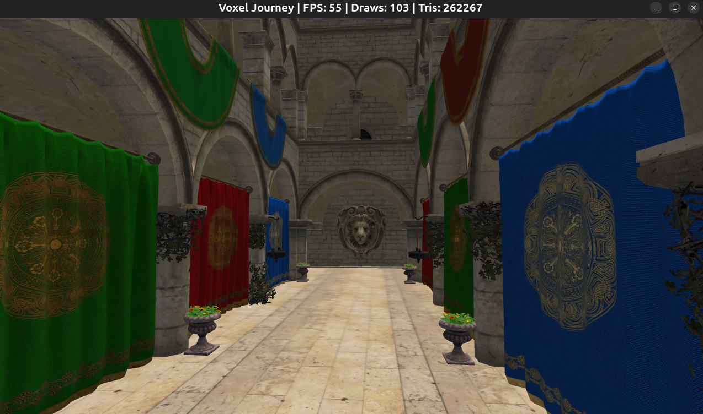

# A simple engine

A simple engine can be used as a starting point for more complex engines or games. It focuses on clarity and a small feature set while keeping modern OpenGL practices.

## Demo Sponza scene

## Build and run
Dependency management is handled with vcpkg. Make sure to install the required libraries.
- Configure vcpkg with CMake: `make configure`
- Build: `make build`
- Run: `make run`
- Clean: `make clean`

## Features
- OpenGL 4.5 DSA for buffers/VAOs/textures.
- Frame UBO for per-frame camera and light data.
- Directional sun + ambient + optional point lights.
- Instanced rendering, CPU batching by mesh/material with frustum culling.
- glTF model loading with tinygltf.
- Simple camera controller with mouse look and WASD movement.
- Wireframe toggle and fullscreen mode.
- Basic stats display with configurable update interval.
- Simple event system for input handling.
- Asset manager with caching for shaders, textures, materials and models.
- Simple config system with INI sections.

## Dependencies
- CMake and Makefile for building.
- Vcpkg for dependency management.
- OpenGL + GLAD for rendering.
- GLFW for windowing and input.
- GLM for math.
- stb_image for textures.
- tinygltf for glTF models.
- SimpleIni for config parsing.

## Project layout
- assets: Textures, models, and shaders.
- build: CMake build output.
- cmake: Helper CMake scripts (asset copying).
- src: Engine code.
- CMakeLists.txt, Makefile, vcpkg.json, vcpkg-configuration.json.

## Engine architecture

### Core
- Application: Owns the main loop, window, renderer, asset manager, and scene.
- Window: GLFW setup, OpenGL context, and event callbacks.
- Input: Frame-based input state built from events.
- EventBus: Small event queue used by window callbacks.
- Config: Reads config.ini for runtime settings.

### Rendering
- Shader: GLSL program compilation and uniform updates.
- Texture: Image loading and OpenGL texture setup.
- Material: Shader + textures + render state, matching glTF data. Lighting is simple diffuse.
- Mesh: Vertex and index buffers with instanced rendering (OpenGL 4.5 DSA).
- Renderer: Batches by mesh + material and draws instanced geometry (Frame UBO + lights).
- Renderable: Mesh + material + transform tuple submitted to the renderer.

### Assets
- Asset: Minimal base class with a path.
- AssetHandle: Lightweight, type-safe references to assets.
- AssetManager: Loads and caches shaders, textures, models, and materials.
- Model: Loads glTF into meshes and materials.

### Scene
- Scene: Owns renderables and updates game logic.
- Player: Camera controller (mouse look + WASD).
- Camera: View and projection math.
- Transform: Position, rotation, scale helper.

## Controls
- WASD: Move
- Mouse: Look
- Space / Left Ctrl: Up / down
- F3: Wireframe toggle
- F12: Toggle fullscreen
- Esc: Quit

## Config
Settings are loaded from config.ini with sections for window, input, camera, and stats.

