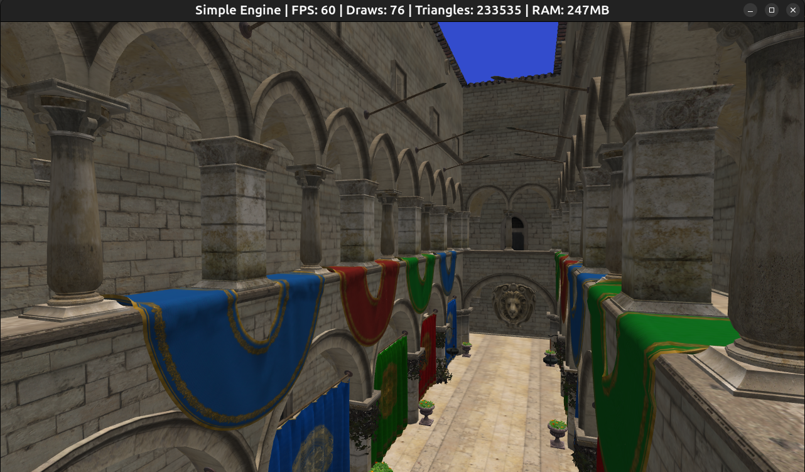
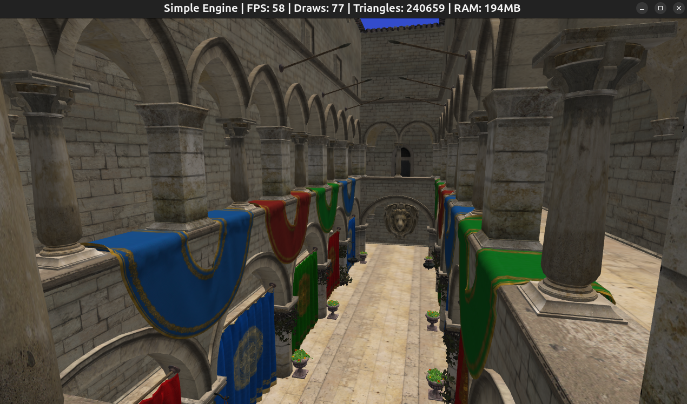

# A simple engine
Modern C++23 OpenGL4.6 engine that can be used as a starting point for more complex engines or games. It focuses on clarity and a small feature set while keeping modern practices.

## Engine Features
- Instanced forward rendering, CPU batching by mesh/material with frustum culling.
- glTF/glb model loading with tinygltf.
- Frame UBO for per-frame camera and light data.
- Directional sun + ambient + optional point lights.
- Simple camera controller with mouse look and WASD movement.
- Wireframe toggle and fullscreen mode.
- Basic stats display with configurable update interval.
- Simple event system for input handling.
- Asset manager with caching for shaders, textures, materials and models using AssetHandle references.
- Simple config system with INI sections.

For a more detailed look at the engine’s architecture and possible improvements, check out the [game-engine](https://kafkaphoenix.github.io/categories/game-engine/) blog section and the [architecture](docs/architecture.md).

## Build & Run

See the [build instructions](docs/build.md) for detailed steps on how to build and run the engine.

## Demo Sponza scene

A demo scene is included with the Sponza model.

### Controls
- WASD: Move
- Mouse: Look
- Space / Left Ctrl: Up / down
- F3: Wireframe toggle
- F12: Toggle fullscreen
- Esc: Quit

| Format | Load Time | Size | Textures |
|--------|-----------|------|----------|
| GLTF | ~5s | 325MB | External files |
| GLB | ~3s | 325MB | Embedded |

*Sponza GLTF model with external textures*

*Sponza GLB model with embedded textures*