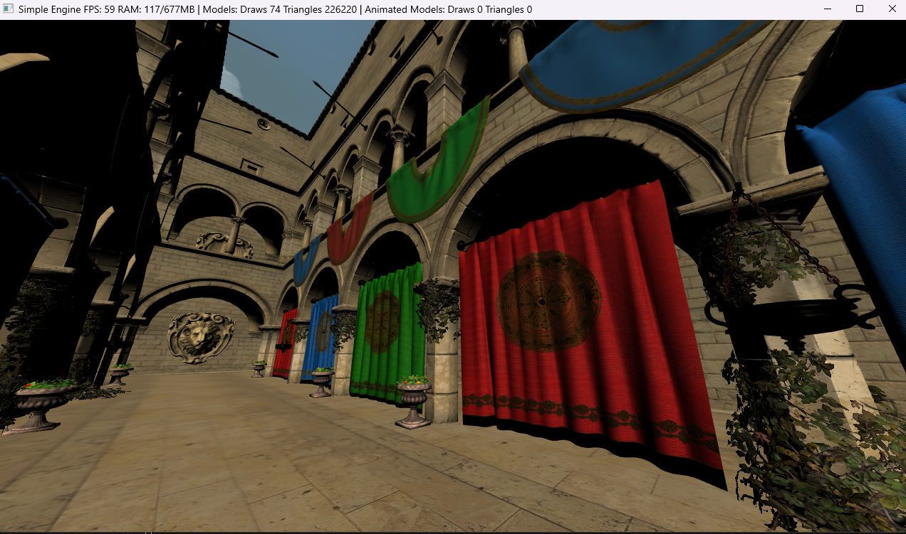

# A simple engine
Modern C++23 OpenGL4.6 engine that can be used as a starting point for more complex engines or games. It focuses on clarity and a small feature set while keeping modern practices.

## Engine Features
- OpenGL instanced forward renderer supporting CPU batching by mesh/material, and frustum culling.
- Models with optional support for skeletal animation.
- Diffuse lighting with multiple light sources.
- Simple camera controller with mouse look and WASD movement.
- Basic stats display with configurable update interval.
- Off-screen framebuffer with HDR (RGBA16F) and post-processing pipeline (tone mapping, inversion, grayscale, sharpen, blur, edge detect).
- Simple event system for input handling and window events.
- Asset manager with caching using lightweight handles.
- Simple config system for runtime settings.

For a more detailed look at the engine’s architecture, check out the [game-engine](https://kafkaphoenix.github.io/categories/game-engine/) blog section and the [architecture](docs/architecture.md).

## Build & Run

See the [build instructions](docs/build.md) for detailed steps on how to build and run the engine.

## Demo Sponza scene

A demo scene is included with the Sponza model.

### Controls
- WASD: Move
- Mouse: Look
- Space / Left Ctrl: Up / down
- F3: Wireframe toggle
- F4: Cycle post-process effect
- F12: Toggle fullscreen
- Esc: Quit

*Sponza model*